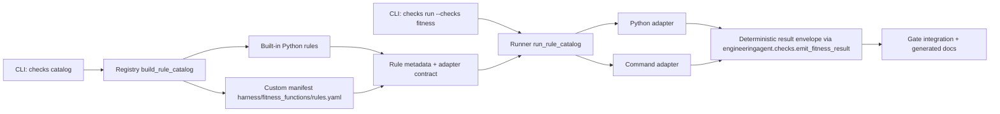

# Fitness Framework Architecture

```mermaid
flowchart LR
    A[CLI: checks catalog] --> B[Registry build_rule_catalog]
    X[CLI: checks run --checks fitness] --> F[Runner run_rule_catalog]
    B --> C[Built-in Python rules]
    B --> D[Custom manifest harness/fitness_functions/rules.yaml]
    C --> E[Rule metadata + adapter contract]
    D --> E
    E --> F[Runner run_rule_catalog]
    F --> G[Python adapter]
    F --> H[Command adapter]
    G --> I[Deterministic result envelope via engineeringagent.checks.emit_fitness_result]
    H --> I
    I --> J[Gate integration + generated docs]
```
